# 草履虫都能学会的Git与GitHub使用指南

**写在前面**

本教程由 **北京林业大学森林狼机器人战队 Lee** 编写。 初衷是为了战队内部的交流与培训，旨在进行“计算机扫盲”，帮助大家切实提升工具使用水平。本教程中的Git主要使用命令行模式，方便各位同学在不同系统中可以通用这一套方法，现在已经很多带有UI的Git问世，使用起来门槛会很低，暂不在本教程中提及，各位同学按需选择。

 *注：本文仅作**内部读物**分享，主打通俗易懂，水平有限，大佬莫笑！*


## 前言：为什么要使用GitHub与Git

简单说，就是为了让你**写代码更从容，抄代码更安全**：

- **自带“后悔药”**：改崩了？误删了？一键回退到昨天的版本，彻底告别 `最终版_v2_改_再改_绝对不改了.zip`。
- **拒绝“二道贩子”**：直接从原作者手里拿代码，没有广告弹窗，没有中间商加料篡改，原汁原味。
- **队友“不打架”**：你写车轮，我写底盘，自动合并在一起。不用拿U盘拷来拷去，更不会不小心覆盖掉队友通宵写的代码。
- **团队“藏经阁”**：文档、代码、资料都在云端，新人进队一目了然，不用追着老学长要文件。


[TOC]


## 一、GitHub账号注册与登录（可跳过）

在这个阶段，我们将获得进入代码世界的“身份证”。请务必一步步跟着做，不要跳过。

**第一步：准备工作**

在打开网页之前，你需要准备好以下三样东西：

1. **稳定的邮箱**：推荐用 Gmail、Outlook，国内的 QQ 邮箱、163 邮箱也可以（由于 GitHub 服务器在海外，QQ 邮箱偶尔可能会收不到邮件，如果在垃圾箱也没翻到，就换个邮箱）。

2. **网络环境（科学上网）**：**【重点】** 虽然 GitHub 在国内偶尔能直接访问，但极其不稳定（图片裂开、速度极慢是常态）。为了后续不报错，**强烈建议开启“科学上网”工具**，并开启**全局模式**。

   

**第二步：进入官网注册**

1. 打开浏览器（推荐 Chrome 或 Edge），输入官网地址： `https://github.com`

2. 在首页右上角，点击白色的 **“Sign up”**（注册）按钮。

   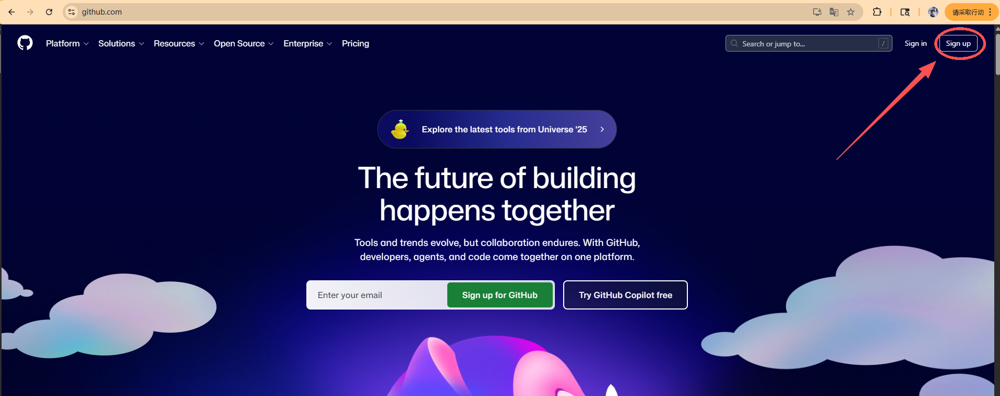

**第三步：填写信息**

GitHub现在的注册页面会一行一行问你：

1. **email**：输入你的邮箱地址
2. **Create a password**：设置密码。
   - *注意：密码需要足够强（包含大小写字母+数字/符号），如果你输入的密码显示红字，说明太简单了，加点符号试试。*
3. **Enter a username**：给自己起个名字。
   - *警告：* 这个名字会显示在你的主页地址栏里（例如 `github.com/你的名字`），也会出现在你未来的代码提交记录里。**建议起个正经点的英文名（如 `SanZhang2024`），千万别乱敲脸滚键盘，因为这可能会出现在你未来的求职简历上！**
4. **Email preferences**：问你要不要收广告邮件。不要勾选，然后点 `Continue`。
5. 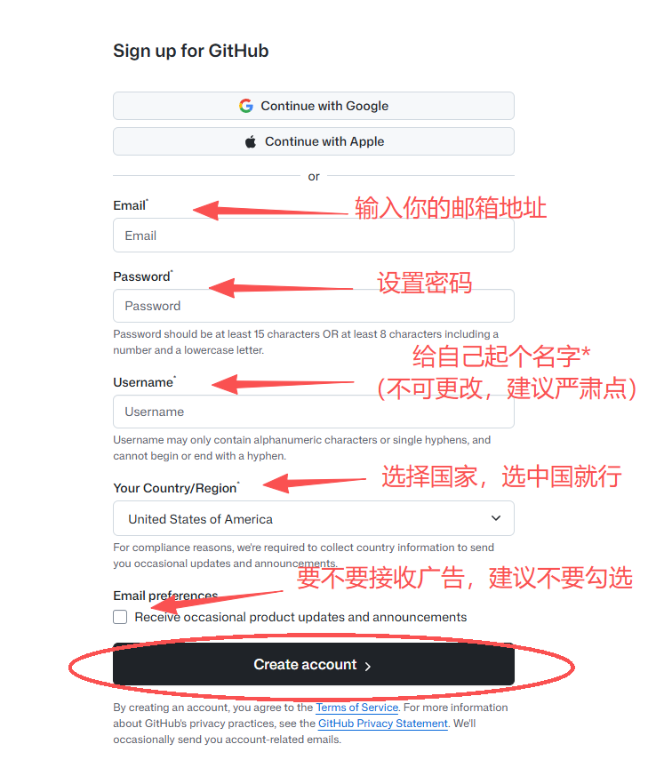

**第四步：真人验证**

接下来会出现一个**验证码环节**（Verify your account）。

- 通常是“选出两个一样的图标”或者“把动物旋转到正确方向”或者“计算螺旋星系”。
- *吐槽：* 有时候这个验证很变态，如果失败了多试几次，耐心一点。

验证通过后，点击最下方的 **“Create account”** 按钮。

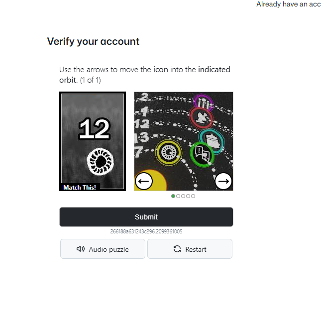

**第五步：邮箱验证码**

GitHub 会向你的邮箱发送一串数字验证码。

- 去你的邮箱找到邮件。

- 去你的邮箱收信（如果没有，翻翻垃圾箱，或者看看是不是邮箱地址填错了）。

- 邮件标题通常叫 *Your GitHub launch code*，里面有一串显眼的 **8位数字**。

- 把数字填回到网页里。

  

**第六步：登录账号**

完成上面验证后你会回到主页

- 在首页右上角，点击白色的 **“Sign in”**（登录）按钮。
- 输入你刚才注册的账号密码
- 通过你的邮箱接受验证码
- 完成登录

 

**第七步：大功告成**

完成上述步骤后，当你看到一个左上角有八爪鱼猫头像（GitHub图标），中间可能写着 "Dashboard" 或者让你 "Create a new repository" 的页面时，**恭喜你！注册流程彻底结束了。**

------

**给草履虫的总结：**

1. 开梯子。

2. 起个好听的英文名（别乱填）。

   

#### 【重要补充】关于双重验证 (2FA) 的防坑提醒

虽然刚才注册时 GitHub 放了你一马，没强制你开 **2FA（双重身份验证）**，但这里必须给你打个预防针：

**GitHub 可能会在未来某一天突然拦截你**，说：“为了安全，请开启 2FA 才能继续操作”。

- **这是啥？** 就是以后登录不仅要密码，还要手机 App 上生成的一个 6 位数动态码。
- **咋办？** 别慌。如果你以后登录时突然弹窗让你扫二维码（Setup Two-factor authentication），那是正常现象。
- **到时候去哪看教程？** 别急，等它真的弹出来拦路的时候，你再翻到本手册的**附录章节**，那里有详细的《2FA 开启与恢复代码保存保姆级教程》。

**现在，先享受你的代码之旅吧！**


## 二、Git下载与安装与配置入门

**第一步：下载并安装 Git（可跳过）**

**1. 下载软件**

1. 访问 Git 官方下载页面：[git-scm.com/download/win](https://git-scm.com/download/win)

2. 点击 **"Click here to download"** 下载最新的 64 位安装程序。

   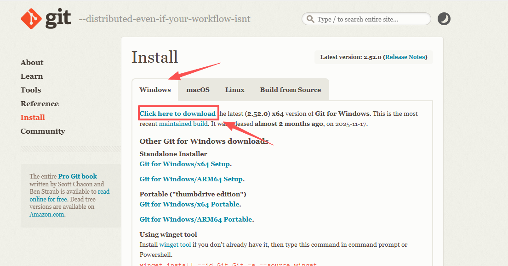

**2. 安装过程中的关键设置**

1. 双击运行下载好的 `.exe` 文件。
2. **核心策略**：安装程序会问你一大堆问题，如果你看不懂，**请一路狂点 "Next"（下一步），直到 "Install"（安装）**。默认设置已经够用了！
3. *进阶一点点（仅供学有余力的草履虫参考）：*
   - 选择组件 (**Select Components**)：建议勾选 Git Bash Here 和 Git GUI Here，这样你可以在任何文件夹右键快速打开 Git。
   - 选择默认编辑器**(Choosing the default editor)**：如果你平时用 VS Code，可以在下拉菜单选 Visual Studio Code；如果没有偏好，就选默认的 Vim。如果你还没装 VS Code，就让它选 Vim 别动；装了就选 Visual Studio Code。
   - 调整 PATH 环境 **(Adjusting your PATH environment)**：确保选中 Git from the command line and also from 3rd-party software（这是推荐选项）。
   - 选择终端模拟器：建议选 MinTTY。
   - *再次强调：**选不明白就直接 Next**，不会爆炸的。*

**3. 验证安装是否成功**

安装完成后，点击 Windows 任务栏的“搜索”，输入 **Git Bash** 并打开。在弹出的黑窗口中输入以下命令：

Bash

```
git --version
```

如果看到类似 `git version 2.x.x.windows.1` 的字样，说明你已经成功安装了！

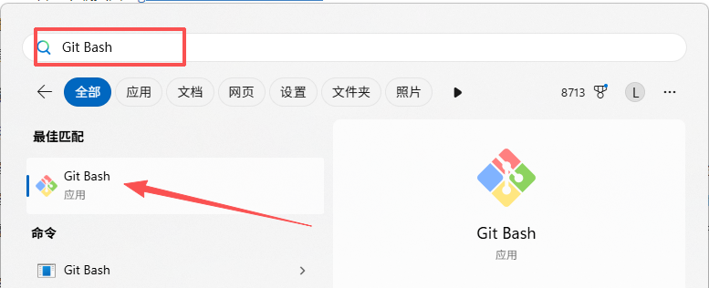

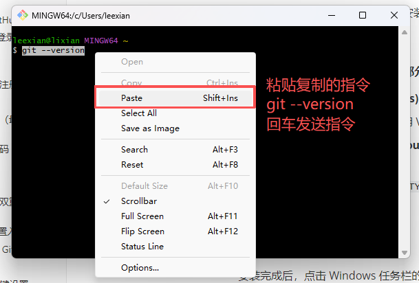

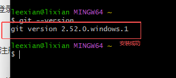

**第二步：初始配置（必做）**

安装好 Git 后，你需要告诉它你是谁，这样在你提交代码时，Git 才能记录是谁做的修改。否则以后你提交代码，Git 不知道记谁的账。

**【高能预警】请务必使用你刚刚注册 GitHub 时的用户名和邮箱！**

在 **Git Bash(刚刚用的那个黑框框)** 中依次输入以下两条命令**一行输完按一次回车**：

1. **设置名字**（把双引号里的内容换成你的 **GitHub 用户名**，比如 *Jees996*）：

   Bash

   ```python
   git config --global user.name "你的GitHub用户名"
   ```

2. **设置邮箱**（**重要！** 必须是你 **注册 GitHub 时填的那个邮箱**）：

   - *原因：如果你乱填，以后你在 GitHub 上提交的代码头像就是灰色的，也不会计入你的贡献墙！*

   Bash

   ```python
   git config --global user.email "你注册GitHub用的那个邮箱"
   ```

*(输完命令按回车后，如果没有任何报错提示，直接跳出下一行，说明设置成功了。Unix哲学的沉默就是金！)*


## 三、如何创建仓库（基础，必须掌握）

本章将带你上手 Git 的核心基础。首先，我们需要解决“仓库从哪来”的问题，通常有两种方式：**自己新建**或**从网上下载**。

本教程将基于三种实际情况进行分别演示：

1、本地没有文件，使用GitHub创建全新的仓库

2、本地有文件，在GitHub创建新仓库并绑定

3、下载他人现成的仓库


### 1、自己创建一个新的仓库

#### 第一步：在 GitHub 建立新仓库

**适用场景**：不管你电脑上有没有任何代码，都可以先在 GitHub 上建好仓库，再把它下载（克隆）到电脑上开始写作业。


1. **第一步：在 GitHub 官网建立新仓库**

   请打开 [github.com](https://github.com) 并登录，点击右上角的 **“+”** -> **“New repository”**（新建仓库），进入创建页面。

   

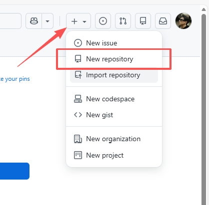

请对照你看到的页面（就是下面这张图），按以下标准填空：

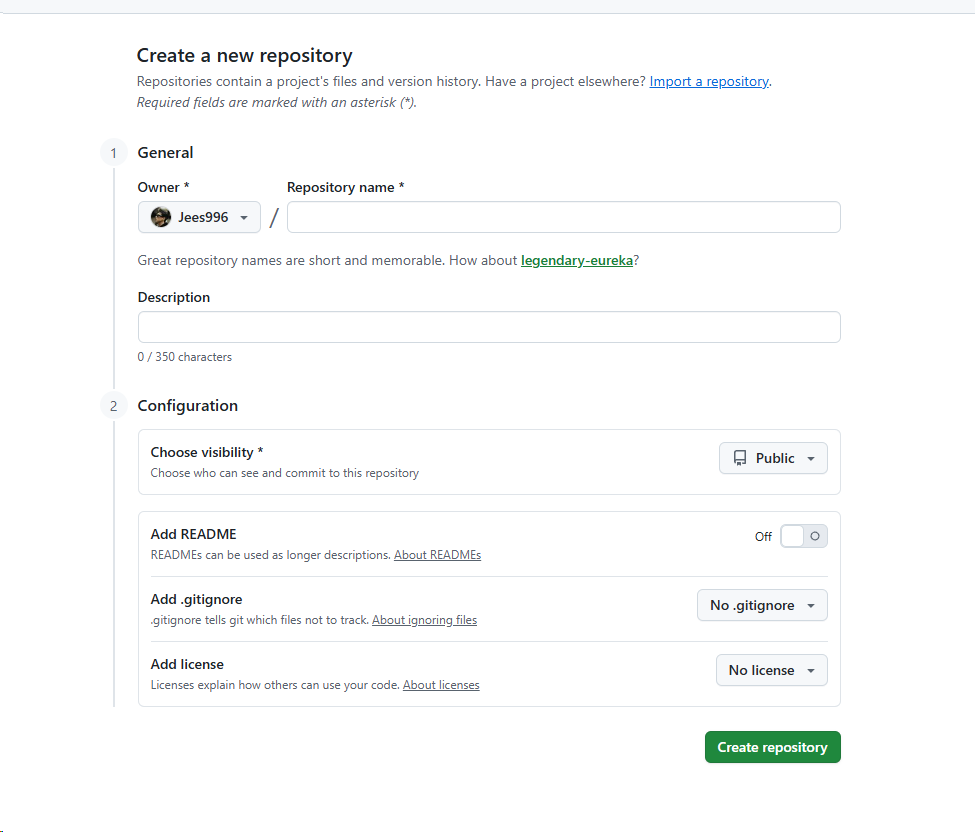

**1. General (常规设置)**

- **Owner (拥有者)**：默认是你自己，不用改。
- **Repository name (仓库名)**：输入 `test`。
  - *这是必填项，为了后续教程统一，请务必叫这个名字。*
- **Description (描述)**：选填，可以写“我的第一个测试项目”。

**2. Configuration (配置选项)**

- **Choose visibility (选择可见性)**：

  - **【关键】** 请手动选择 **Private (私密)**。
  - *理由：作为草履虫入门，我们先关门练功，只有你自己能看到代码，安全感拉满。*

- **Add README (添加说明文件)**：

  - **【注意！关键点】 请保持默认 Off (不要勾选/灰色)**。
  - *理由：千万别勾！我们要创建一个纯净的“空壳子”，这样 GitHub 才会显示出那个教我们怎么上传代码的“作弊小抄”页面（就是下面要用的代码块）。这个“readme文件你可以后续自己创建”*

- **Add .gitignore**：保持默认 **No .gitignore**。

  *是什么？* 它是给 Git 看的**“垃圾屏蔽名单”**。写在里面的文件（比如程序运行时产生的临时缓存、编译生成的乱七八糟的中间文件），Git 会自动无视它们，只上传代码源文件。

  *备注：* **新手先不管**。以后等你项目复杂了，不想上传垃圾文件时再加也不迟。

- **Add license**：保持默认 **No license**。

  *是什么？* 它是给人类（和律师）看的**“法律声明”**。规定别人能不能抄你的代码、能不能拿去卖钱（比如著名的 MIT 协议、GPL 协议）。

  *备注：* **新手先不管**。

**3. 完成创建**

- **Create repository**：确认以上信息无误后，点击页面右下角的绿色按钮 **“Create repository”**。


#### **第二步：在本地创建仓库并与GitHub绑定**

创建成功后，你不会看到文件列表，而是会看到下面这个页面。

这是 GitHub 怕你不会用，贴心地给你准备的 **“一行代码都不用自己写”** 的复制粘贴区，以帮助你完成本地仓库的建立与绑定：

*（这个页面是你没选择生成任何文件才会出现，如果没有这个页面可以重新创建一次，或者手动输入命令也可以）*


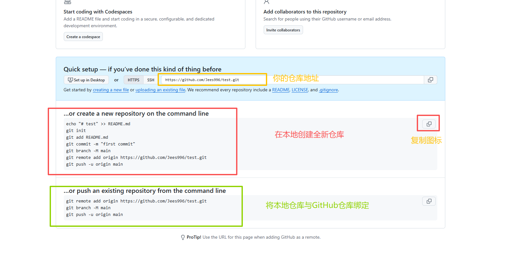


这时候请进入你想要存放项目的文件夹（比如 `D:\Work\stm32\test`），然后根据你的情况，二选一：


##### 情况 A：本地没有文件，创建全新仓库

**...or create a new repository on the command line**

**适用场景**：你电脑上也是空的，想从零开始建仓库。


**第一步：准备终端** 请在电脑上打开 **Git Bash**，输入 `cd /d/Work/stm32/test`（或者直接在 `D:\Work\stm32\test` 文件夹里右键打开 Git Bash）。

**第二步：一键执行** 点击 GitHub 页面代码块右上角的 **复制图标**（或手动复制下面这坨代码），**一次性粘贴**到你的 Git Bash 黑框里，按回车执行。

Bash

```python
echo "# test" >> README.md
git init
git add README.md
git commit -m "first commit"
git branch -M main
git remote add origin https://github.com/Jees996/test.git
git push -u origin main
```


**【成功标志】** 只要黑框框最后没有出现 `Error` 字样，并且看到了 `Branch 'main' set up to track remote branch...` 的提示，说明你的本地代码已经成功上传到 GitHub 了！


**代码功能速查表** 如果不明白这坨代码在干什么，请对照下表，这些常用指令都会在后续讲到，不看也行。

| **代码指令**                 | **核心功能**     | **详细说明**                                                 |
| :--------------------------- | ---------------- | ------------------------------------------------------------ |
| `echo "# test" >> README.md` | **创建文件**     | 新建一个名为 `README.md` 的文件，并写入内容。Git 无法追踪空文件夹，必须有文件才能初始化。 |
| `git init`                   | **初始化仓库**   | 在当前目录下生成 `.git` 隐藏文件夹，使其成为一个受 Git 管理的本地仓库。 |
| `git add README.md`          | **添加到暂存区** | 将新创建的文件加入 Git 的追踪列表（暂存区），准备提交。      |
| `git commit -m "..."`        | **提交到本地**   | 将暂存区的内容正式归档，生成版本历史中的第一个“节点”。       |
| `git branch -M main`         | **重命名分支**   | **关键步骤**。将本地默认分支（通常叫 `master`）强制重命名为 `main`。 |
| `git remote add origin ...`  | **绑定远程地址** | 将本地仓库与 GitHub 上的云端仓库建立连接，并将云端地址命名为 `origin`。 |
| `git push -u origin main`    | **推送到云端**   | 将本地 `main` 分支的代码上传到远程 `origin` 地址，并建立追踪关系。 |


##### 情况 B：本地有文件，将本地仓库与GitHub仓库连接

**适用场景**：**“补票上车”**。 你的电脑本地已经有一个 Git 仓库了（也就是说，你之前已经写了代码，并且敲过 `git init`、`git add`、`git commit` 这一套连招了），现在只是想把它关联到 GitHub 上保存起来。


------

**🛑 动手前的“资格审查” (必看！)**

**这串代码能运行的绝对前提是：你本地必须已经是一个 Git 仓库！**

**怎么知道是不是？** 请在 Git Bash 黑框里输一下 `git status`。

- ✅ **显示 `On branch ...`**：恭喜，资格符合，请继续往下看。
- ❌ **报错 `fatal: not a git repository...`**：说明你还没“买票”！**请直接跳回上面的（情况 A）**，先把 `git init`、`add`、`commit` 那一套指令全部运行一遍，再来这里。

------

**第一步：一键执行**

确认本地没问题后，复制下面这三行代码（把**仓库地址**换成你自己的），粘贴到 Git Bash 黑框里，回车！

车！

Bash

```
git remote add origin https://github.com/Jees996/test.git
git branch -M main
git push -u origin main
```


**代码功能速查表** 如果不明白这坨代码在干什么，请对照下表（这些常用指令都会在后续讲到，不看也行）：

| **代码指令**                | **核心功能**     | **详细说明**                                                 |
| --------------------------- | ---------------- | ------------------------------------------------------------ |
| `git remote add origin ...` | **绑定远程地址** | 将本地仓库与 GitHub 上的云端仓库建立连接，并将云端地址命名为 `origin`。 |
| `git branch -M main`        | **重命名分支**   | **关键步骤**。将本地默认分支（通常叫 `master`）强制重命名为 `main`，防止推送到云端时因为名字对不上而报错。 |
| `git push -u origin main`   | **推送到云端**   | 将本地 `main` 分支的现成代码直接打包上传到远程 `origin` 地址，并建立追踪关系。 |


------

💡 常见报错自救

**Q：我粘贴后报错 `fatal: remote origin already exists.` 怎么办？**

- **人话**：Git 说“你之前已经存过一个叫 origin 的号码了，不能重复存”。
- **解决**：说明你以前可能乱绑过地址。输入 `git remote remove origin` （删除旧号码），然后重新执行上面的第一行代码即可。


### 2、从 GitHub 下载他人仓库 (`git clone`)

**场景**：要把“北京林业大学 RoboMaster 视觉组”的资料下载到电脑上。

- **第一步：复制地址** 进入我们队伍的GitHub，找到视觉组的这个仓库，仓库链接：https://github.com/BJFU-Forestry-Wolves/BJFU-Vision-Group-from-Beginner-to-Master.git

  *（因为这个项目是开源的，所以以此为例，其他项目也一样通用。队伍内有一些仓库是闭源的，比如英雄的代码，想要下载需要先绑定你的Git和GitHub账号，后面再说）*

- 复制目标仓库链接： `https://github.com/BJFU-Forestry-Wolves/BJFU-Vision-Group-from-Beginner-to-Master.git`

  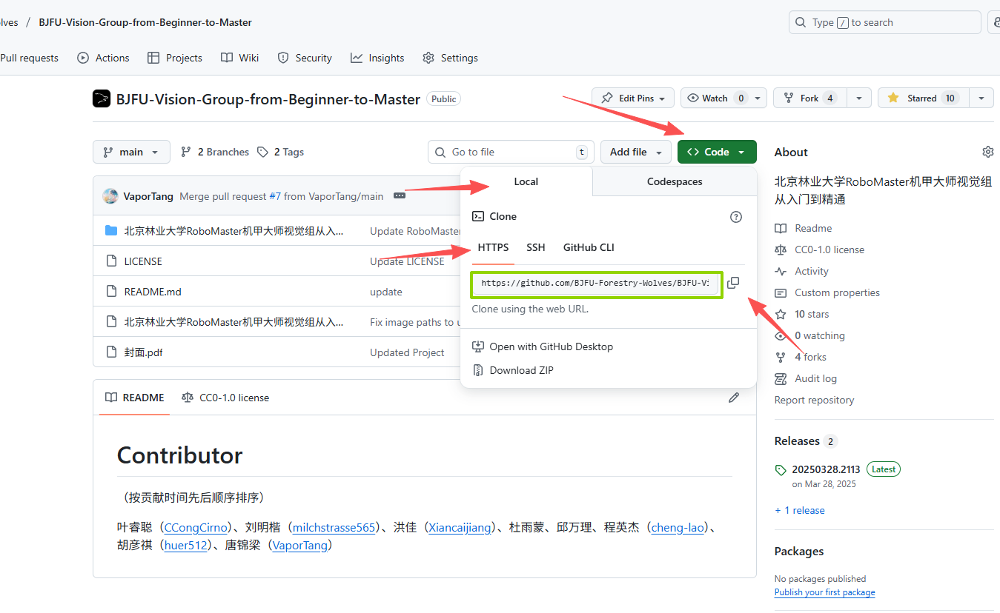

- **第二步：选择存放位置** 进入你想存放该项目的**父级文件夹**（例如 `D:\work`），在空白处**右键** -> **"Git Bash Here"**。 *(注意：不需要手动新建空文件夹，Git 会自动建。)*

- **第三步：执行下载** 输入 `git clone`，空格，然后**右键选择 Paste**（或按 `Shift + Insert`）粘贴地址。 完整命令如下：

  Bash

  ```python
  git clone https://github.com/BJFU-Forestry-Wolves/BJFU-Vision-Group-from-Beginner-to-Master.git
  ```

  按回车执行。

- **第四步：等待完成** 当看到 `100%` 且光标恢复输入状态时，下载结束。你可以去文件夹里看到下载好的项目了。


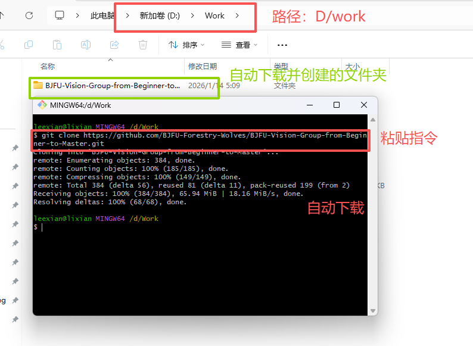


### 补充教程：初始化本地仓库

1、在本地新建仓库 (`git init`)

**场景**：你有一个现成的项目文件夹 `D:\work\stm32`，想用 Git 管理它。

- **第一步：进入目录** 打开文件管理器，进入 `D:\work\stm32` 文件夹。

- **第二步：打开终端** 在文件夹空白处**右键**，点击 **"Git Bash Here"**。

- 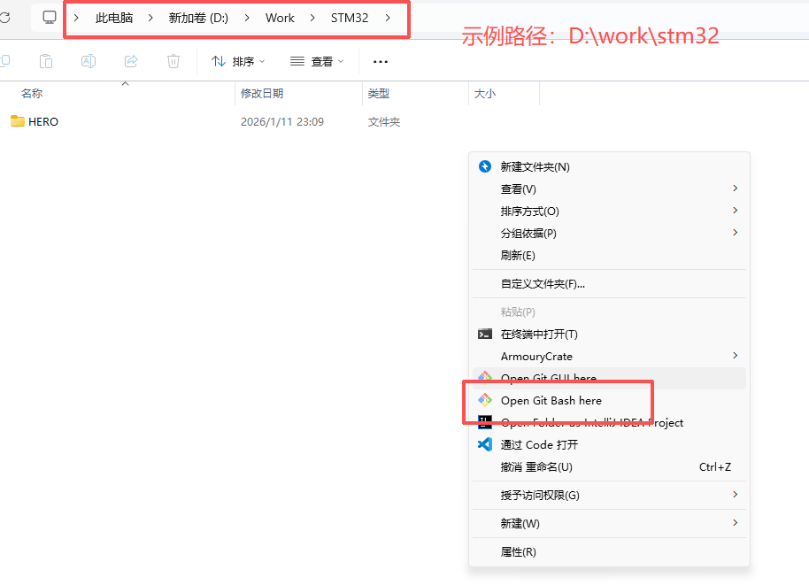

- **第三步：初始化** 在黑框中输入以下命令并回车：

  Bash

  ```python
  git init
  ```

  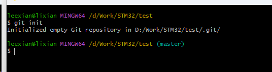

- **第四步：验证**

  - 命令行路径后出现 `(master)` 或 `(main)` 字样。

  - 文件夹内自动生成了一个隐藏的 `.git` 文件夹（不要删除，不要修改）。

  - **完成**。

    ​                                                                           查看隐藏的文件夹（只是演示，可以不打开这个设置）

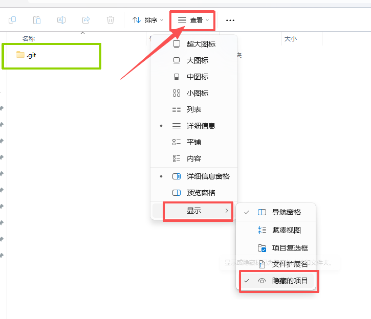


## 四、常用基础指令（日常开发）

本章将介绍 Git 在日常工作中最高频使用的指令。只要学会第一节的这三个命令，你就能应对 90% 的开发场景。

注意：请按照上一章教程创建仓库，不然可能会出现比如分支名不一致等问题


### 1 、三条核心指令：Add, Commit, Push

这三个指令的操作逻辑非常符合直觉，你可以把它想象成**网购**的全过程：

1. **`add`**：把想买的商品放进**购物车**。
2. **`commit`**：点击**下单结算**，生成订单（存档）。
3. **`push`**：快递**发货**，送到云端。

演示准备：

请进入 D:\Work\STM32\test 文件夹，新建一个文本文档 test.txt，在里面随便写一句 "Hello Git" 并保存关闭。（Git 只会追踪有内容的文件，空文件夹它是看不见的）。

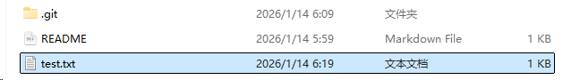


**第一步：添加到暂存区 (`git add`)**

**作用**：告诉 Git，“我刚修改了文件，请把它们放进购物车，准备提交”。

- **操作**：在黑框中输入：（注意，需要你的黑框路径在你的库 D:\Work\STM32\test中，这点很重要，在文件夹的空白处 **右键** -> **Git Bash Here**）

  Bash

  ```
  git add .
  ```

- **细节详解**：

  - **空格**：注意 `add` 和 `.` 之间必须有一个空格。
  - **`.` (点)**：这是一个通配符，代表“当前目录下的**所有**变动”。
  - **效率**：不管你改了 1 个文件还是 100 个文件，用 `git add .` 可以一次性把它们全部装进购物车，最省事。

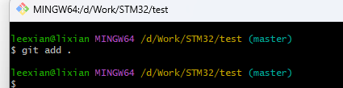


**第二步：提交到本地仓库 (`git commit`)**

**作用**：将购物车里的内容**“下单结账”**，在本地生成一个永久的历史版本。

- **操作**：输入以下命令（注意引号）：

  Bash

  ```
  git commit -m "第一次提交测试文件"
  ```

- **细节详解**：

  - **`-m`**：是 `message`（信息）的缩写。
  - **双引号内容**：这是本次提交的**备注**。
  - **重要性**：**备注要写人话！** 比如“修复电机BUG”或“新增PID参数”。千万别只写“update”或者“111”，否则一周后你自己都不知道这次改动是为了啥。

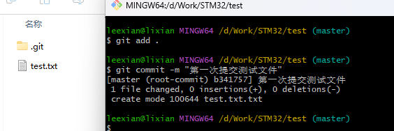


**第三步：推送到 GitHub (`git push`)**

**作用**：将本地做好的存档**“同步”**到 GitHub 云端服务器。

- **操作**：输入：

  Bash

  ```
  git push
  ```

- **结果验证**：

  - 终端显示 `Writing objects: 100%` 即代表成功。
  - **此时去 GitHub 网页刷新一下你的仓库页面**，你会发现 `test.txt` 已经出现在那里了。

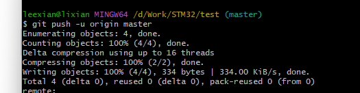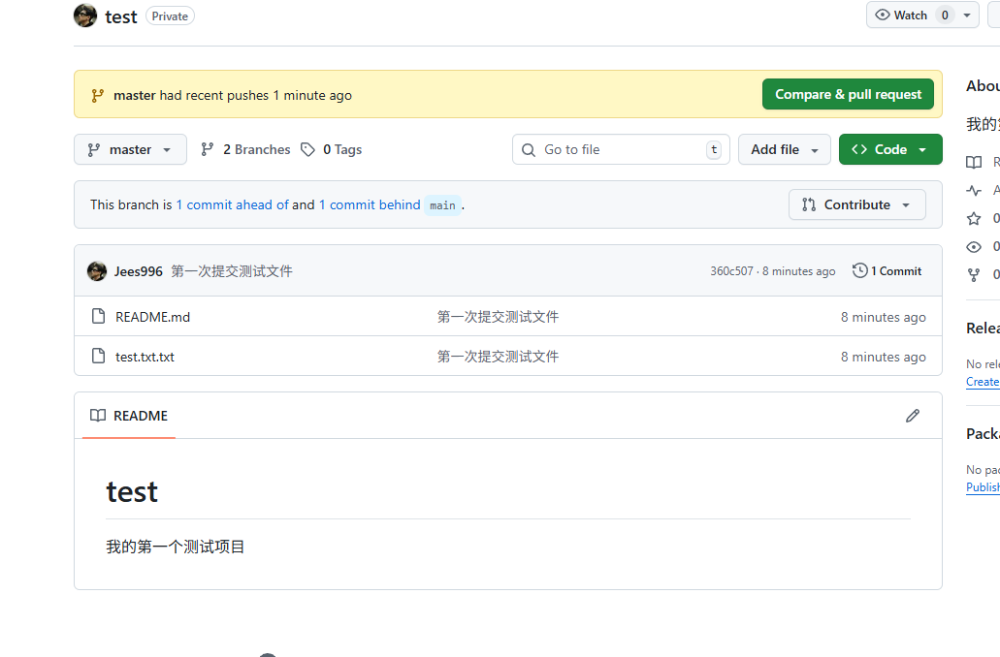


#### 🚑 紧急救援：第一次 Push 报错了？

​        如果你在执行 `git push` 时，看到下面这行的报错：

> ```
> fatal: The current branch master has no upstream branch.
> ```

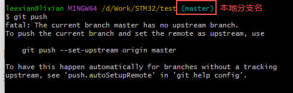

**别慌，这非常正常！**

- **原因**：这是由于你本地创建仓库并初始化的时候没有使用GitHub提供的快捷命令，并且没有更改本地分支名，本地默认是master，云端默认是main，而导致推送失败。

- **解决办法**： 使用用下面这两行命令更改你本地分支名与云端对齐：

  

**操作步骤（两行代码搞定）：**

1. **本地改名**： 输入下面这行命令，把本地的 `master` 强制改名为 `main`：

   Bash

   ```
   git branch -M main
   ```

   - *现象：你会发现黑框框里的 `(master)` 瞬间变成了 `(main)`。*

2. **推送并绑定**： 现在名字一样了，我们再次尝试推送，并告诉 Git “以后这就叫主分支”：

   Bash

   ```
   git push -u origin main
   ```

3. **成功标志**： 当看到 `Branch 'main' set up to track remote branch 'main' from 'origin'` 的提示时，说明**改名+上传+绑定**全部搞定！ 以后再修改代码，直接输简单的 `git push` 就可以了。


**以后还用输这么长吗？** 不用！加了这个 `-u` 之后，Git 就记住这条路了。**以后你只需要输 `git push` 这两个词，它就能自动识别路径了。**

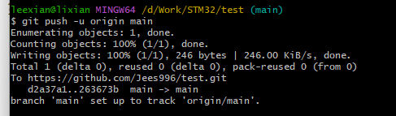


### 2、查看历史记录(`git log`)

代码写着写着忘了几号版本是能跑的？或者想揪出是谁写了那个 Bug？这时候就需要查查“家谱”了。


**操作步骤：**

1. **输入命令**： 在终端里输入：

   Bash

   ```
   git log
   ```

   *（强烈推荐加 `--oneline` 这个小尾巴，它会让日志变得非常简洁，一行一条，不占地儿。`git log --oneline`）*

   

2. **看懂信息**： 屏幕上会吐出一串列表，你只需要关注两个核心信息：

   - **黄色的乱码（Commit ID）**：例如 `a1b2c3d`。

     - **这是啥？** 它是版本的身份证号，也是你穿越时空的**“机票代码”**。想回到这个版本，全靠这串数。

   - **后面的文字**：这就是你 `commit -m` 时写的备注。现在知道为什么要好好写备注了吧？

     

3. **🚨 逃生指南（按 Q 退出）** 如果你的历史记录太长，屏幕最下面出现了冒号 `:`，这时候你会发现光标卡住了。

   - **动作**：按一下键盘上的字母 **`q`** (Quit)，就能瞬间退出查看模式，回到黑框框。


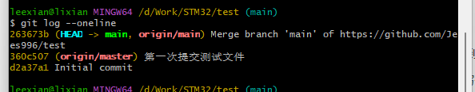


### 3 版本回退 (`git reset`)

当你确定现在的代码已经烂到没救了，想彻底回到昨天那个“能跑”的版本。Git 能让你一键穿越。

**操作步骤：**

1. **找票根（版本号）**： 先用上面的 `git log --oneline` 找到你想穿越回去的那个版本的 **Commit ID**。

   - *不需要复制全部，复制前 6-7 位就够了，比如 `e3d2a1`。*

2. **启动时光机**： 输入下面这行命令（注意空格，把下面的 `e3d2a1` 换成你查到的号码）：

   Bash

   ```
   git reset --hard e3d2a1
   ```

3. **见证奇迹**： 按回车。Git 会提示 `HEAD is now at...`。 这时候你去打开你的代码文件夹，你会发现**所有的文件都瞬间变回了那一刻的样子**！

------

#### ⚠️ 安全须知

**关于 `--hard` 参数**： 命令里那个 `--hard`（硬复位）是个狠角色。

- **它的意思是**：**“别废话，把我现在所有改乱的东西全扔掉，强制恢复到那个版本。”**
- **副作用**：**你从“那个版本”之后写的所有新代码，都会瞬间灰飞烟灭，找不回来的那种！**
- **建议**：在使用这招之前，确保你现在手头没有重要的新代码，或者先把重要的文件另外备份一份。


### 4、检查当前状态 (`git status`)

这是新手最容易忽略，但老手用得最多的指令。当你不知道自己改了哪些文件，或者不知道刚才 `add` 成功没有，输它就对了。建议养成**“没事就输一下”**的好习惯。

**操作步骤：**

1. **输入命令**：

   Bash

   ```
   git status
   ```

2. **看懂颜色（红绿灯）**：

   - 🔴 **红色的字**：代表文件**被修改了**，但还没进购物车（还没 `add`）。
   - 🟢 **绿色的字**：代表文件**已经在购物车里了**（已经 `add`），随时可以下单（`commit`）。
   - **nothing to commit, working tree clean**：代表此时此刻，你的本地代码非常干净，和仓库里的一模一样，没有任何变动。

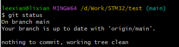


### 5、拉取最新代码 (`git pull`)

在战队里合作开发，最常听到的就是队友吼一嗓子：“代码我推上去了，你拉一下！” 这时候千万别去网页下载压缩包，太 Low 了。

**场景**： 队友更新了视觉识别代码并上传了 GitHub，你需要把他的更新同步到你的电脑上。

**操作步骤：**

1. **输入命令**：

   Bash

   ```
   git pull
   ```

2. **结果说明**：

   - **Fast-forward / Updating...**：屏幕滚动代码，最后显示 `100%`。说明队友的代码已经自动下载并合并进你的文件夹里了，直接打开用就行。
   - **Already up to date**：说明你是最新的，队友在骗你（或者他忘了 Push）。


### **6、给分支改名 (git branch -M)** 

**场景**：嫌名字不好听，或者为了解决“本地 master 与云端 main 不一致”的问题。

**操作步骤**： 直接在黑框里输入：

Bash

```
git branch -M main
```

*(注：如果你想改成其他名字，把 main 换成你想要的英文名即可)*

**结果验证**： 看光标前面的括号，会瞬间从 `(旧名字)` 变身 `(新名字)`。

**后续操作**： 改名后，记得重新绑定云端，否则 Git 找不到路：

Bash

```
git push -u origin main
```


### 待补充更新！


## 5、进阶高级指令（多人协作）

### 待补充更新！


##  常用指令速查表

| **指令**                    | **核心功能**     | **说明与备注**                                               |
| --------------------------- | ---------------- | ------------------------------------------------------------ |
| `git init`                  | **初始化仓库**   | 在当前目录下生成 `.git` 目录，使其成为受 Git 管理的本地仓库。 |
| `git status`                | **查看仓库状态** | 检查工作区文件的变动状态（如已修改、未暂存、未追踪），建议高频使用。 |
| `git add .`                 | **添加所有文件** | 将当前目录下的所有文件变更（增、删、改）添加到暂存区。       |
| `git commit -m "..."`       | **提交到本地**   | 将暂存区的内容正式归档，生成一个新的版本记录。引号内必须填写具体修改备注。 |
| `git log --oneline`         | **查看提交历史** | 以单行简洁格式显示历史提交记录与 Commit ID（版本号）。       |
| `git branch -M main`        | **重命名分支**   | 将当前分支强制重命名为 `main`，常用于对齐 GitHub 默认主分支名称。 |
| `git remote add origin ...` | **绑定远程地址** | 建立本地仓库与远程 GitHub 仓库的关联，并将远程地址命名为 `origin`。 |
| `git push`                  | **推送至远程**   | 将本地仓库的提交记录同步上传到 GitHub 远程仓库。（首次需加 `-u origin main`） |
| `git pull`                  | **拉取远程代码** | 从 GitHub 下载最新的代码并自动合并到本地当前分支。           |
| `git reset --hard [ID]`     | **版本回退**     | 强制将工作区回退到指定版本。**警告：该操作不可逆，会丢弃所有未提交的修改。** |


## 常见问题解决办法

这里收集了新手最容易遇到的“红字报错”和“灵异现象”。如果你卡住了，先来这里找找解药。

#### 1. 推送报错：`! [rejected] ... (fetch first)`

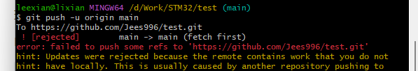

**现象描述：** 当你兴冲冲地执行 `git push` 时，终端给你泼了一盆冷水，出现类似下面的红字：

Bash

```
! [rejected]        main -> main (fetch first)
error: failed to push some refs to '...'
hint: Updates were rejected because the remote contains work that you do not have locally...
```

**人话翻译（原因）：** **“撞车了！”** 这就好比你和队友同时改一个文档。GitHub 发现它的服务器上有一个文件（通常是你创建仓库时手滑勾选生成的 `README.md`），但是你电脑本地的文件夹里**没有**这个文件。 GitHub 觉得：“咦？你这历史记录对不上啊？要是让你强行上传，我这儿的文件就被你覆盖丢了！”于是它无情地拒绝了你。

**解决办法（三步走）：**

我们要做的就是：**先把天上的文件“拉”下来，强行和本地的合并，然后再一起“推”上去。**

**第一步：强行合并（拉取）** 在黑框框里输入下面这行“万能灵药”命令：

Bash

```
git pull origin main --allow-unrelated-histories
```

- *解释：`--allow-unrelated-histories` 就是告诉 Git：“别管它俩以前是不是一家人，现在强行把它们撮合在一起。”*

**第二步：逃离“黑/蓝屏”编辑器（Vim 逃生指南）** 输入上面的命令回车后，你的黑框框很可能会瞬间变样，出现满屏的波浪线 `~` 或者黄色的文字。 别慌！这是 Git 自动打开了 Vim 编辑器让你写备注。我们不需要写，只需要**安全退出**：

1. 按一下键盘左上角的 **`Esc`** 键（确保退出了编辑模式）。
2. 输入冒号和字母 **`:wq`** （注意是英文冒号，w代表保存，q代表退出）。
   - *屏幕左下角会出现 `:wq` 字样。*
3. 按 **回车 (Enter)**。
   - *此时你会回到熟悉的命令行界面。*

**第三步：再次推送** 现在本地和云端已经统一了，再次尝试上传：

Bash

```
git push -u origin main
```

这次你应该就能看到舒服的 `Writing objects: 100%` 成功提示了！


